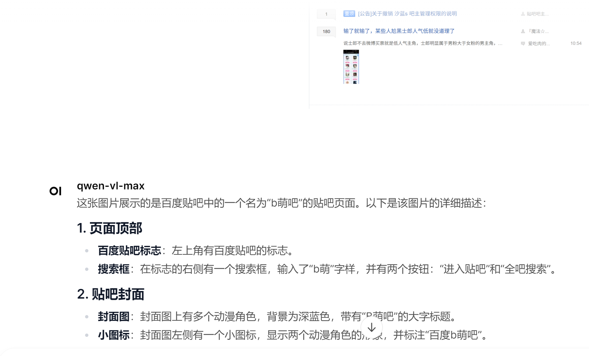

[Open WebUI](https://docs.openwebui.com/) is all you need.

For those who care, many would agree that UI is a "set-aside" detail.

However, I personally find that a well-designed UI and interactive page not only lifts the mood, but also greatly aids in debugging and presentation.

## Installation

For convience and we won't change any code in UI, I strongly recommend [Docker](https://docs.openwebui.com/#quick-start-with-docker-).

Many (including one-day-ago me) are not familiar with modern development toolkits, so it's worth text for a docker guide.

### Docker 

[Docker](https://www.docker.com/) is a lightweight containerization platform that allows you to package applications and their dependencies into isolated environments, ensuring consistency across different systems. You could think it as a VM, if details are not your concerns. For readers in China, I would recommend this [manual](https://yeasy.gitbook.io/docker_practice/install/ubuntu).

The only trouble I encountered is that installing docker requires root previlidge. Consult with your admins in advance.

You don't need to be a docker geek. Here is a simple yet effective guide:

```bash
docker run --rm -d -p host_port:container_port -v host_addr:container_port --name [name] -e ENV=VALUE [IMAGE]
```

`host`: Your machine.

`container`: The jargon for "VM".

`Image`: A snapshot of a machine. Think of it as a class definition, and a container as an instance of that class. Yes, exactly - we instantiate an image and call it a container.

`docker run`: Launch the image.

    `--rm`: remove the container if it shut down. Some old-school users may argue "it's important to preserve the crash dump for debugging", but I've only found that leaving containers around makes my next startup a headache.

    `-d`: run as daemon (in background). Don't add this at your first launch because you might need to see the full logs when things go wrong.

    `-p host_port:container_port`: port mapping. Your app runs inside the container, but you access it from your host machine.

    `-v host_path:container_path`: volume mounting. Think of it as creating a shared folder between your host and the container. Docker likes to put host in the front.

    `--name container_name`: give your container a name. Otherwise Docker will generate something like "sleepy_galileo" for you.

    `-e KEY=value`: set environment variables. The container's equivalent of "export KEY=value". 


I guess you may complain where can I get an image, so here it goes:

```bash
docker pull NAME[:TAG|@DIGEST]
```

Just a reminder: docker would store the images under /var/lib/docker/. Keep your disk from running out.

## Usage

Just a line:

```bash
docker run -d -p 3000:8080 -v open-webui:/app/backend/data --name open-webui ghcr.io/open-webui/open-webui:main
```

You may configure [envs](https://docs.openwebui.com/getting-started/env-configuration). Espeically `OPENAI_API_KEY, OPENAI_API_BASE_URL`.



Bingo~
