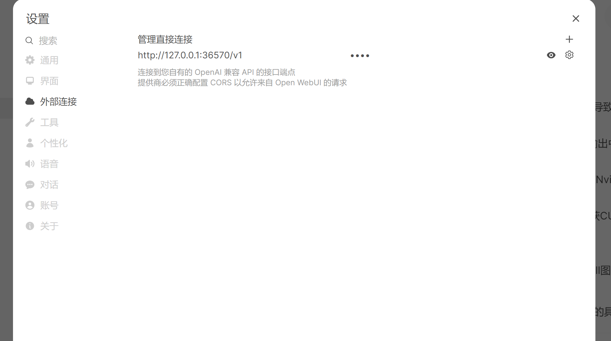
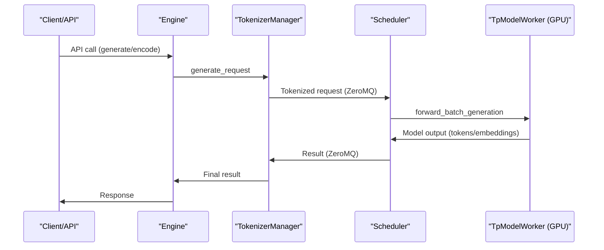

## UV

https://docs.astral.sh/uv/

## SGLang serve first stab

check [endpoint](../walksrc/endpoint.py)

```bash
uv run walksrc/endpoint.py
```

and then, copy the printed port, paste to open-webui's config page:



Don't forget `/v1/` suffix.

Here is some running logs:

```shell
[2025-07-18 15:32:52 TP0] Prefill batch. #new-seq: 1, #new-token: 2192, #cached-token: 35, #token: 35, token usage: 0.00, #running-req: 0, #queue-req: 0, timestamp: 2025-07-18T15:32:52.498932
[2025-07-18 15:32:54 TP0] Decode batch. #running-req: 1, #token: 2266, token usage: 0.00, cuda graph: True, gen throughput (token/s): 3.13, #queue-req: 0, timestamp: 2025-07-18T15:32:54.159394
[2025-07-18 15:32:54 TP0] Decode batch. #running-req: 1, #token: 2306, token usage: 0.00, cuda graph: True, gen throughput (token/s): 75.25, #queue-req: 0, timestamp: 2025-07-18T15:32:54.690982
[2025-07-18 15:32:55 TP0] Decode batch. #running-req: 1, #token: 2346, token usage: 0.00, cuda graph: True, gen throughput (token/s): 75.17, #queue-req: 0, timestamp: 2025-07-18T15:32:55.223142
[2025-07-18 15:32:55 TP0] Decode batch. #running-req: 1, #token: 2386, token usage: 0.00, cuda graph: True, gen throughput (token/s): 75.30, #queue-req: 0, timestamp: 2025-07-18T15:32:55.754374
[2025-07-18 15:32:56 TP0] Decode batch. #running-req: 1, #token: 2426, token usage: 0.00, cuda graph: True, gen throughput (token/s): 75.28, #queue-req: 0, timestamp: 2025-07-18T15:32:56.285727
[2025-07-18 15:32:56 TP0] Decode batch. #running-req: 1, #token: 2466, token usage: 0.00, cuda graph: True, gen throughput (token/s): 75.25, #queue-req: 0, timestamp: 2025-07-18T15:32:56.817286
[2025-07-18 15:32:57 TP0] Decode batch. #running-req: 1, #token: 2506, token usage: 0.00, cuda graph: True, gen throughput (token/s): 74.97, #queue-req: 0, timestamp: 2025-07-18T15:32:57.350827
[2025-07-18 15:32:57 TP0] Prefill batch. #new-seq: 1, #new-token: 306, #cached-token: 235, #token: 235, token usage: 0.00, #running-req: 0, #queue-req: 0, timestamp: 2025-07-18T15:32:57.551492
[2025-07-18 15:32:58 TP0] Decode batch. #running-req: 1, #token: 575, token usage: 0.00, cuda graph: True, gen throughput (token/s): 57.56, #queue-req: 0, timestamp: 2025-07-18T15:32:58.045831
[2025-07-18 15:32:58 TP0] Decode batch. #running-req: 1, #token: 615, token usage: 0.00, cuda graph: True, gen throughput (token/s): 75.33, #queue-req: 0, timestamp: 2025-07-18T15:32:58.576797
```

You cuold see a huge throughput gap between prefill & decoding. I knew it when I study on LLMs, but in VLM it's probably more serious, because handling images is more time-consuming.

Next, we would have a look at VLM's crucial path.


## SGLang Inference Code Walk

It's really annoying to reference a bulk of code files. 

> Interestingly enough, SGLang uses `Scheduler` as the leading component instead of `Engine` (like in vllm). I was "code-shocked" when I read it.

### Inference Path Overview

The core inference path in SGLang is actually pretty clean:

- **Scheduler: The Unified Service Backend**
  Think of the Scheduler as the one true service endpoint for all inference. It's like a bouncer at a club: it pulls requests from a big queue, batches them up (so the GPU doesn't get bored), schedules them, and then tosses the whole batch to the model worker for a forward pass. This is where the magic (and the throughput) happens.

- **Scheduler-Worker**
  Each Scheduler is basically a standalone process, and it's tightly coupled with its own model worker (the thing that actually runs on the GPU). So, for every Scheduler process, there's a dedicated worker process (sometimes they're even the same process, depending on config).

- **Queue Producers: Tokenization Managers Everywhere**
    The requests in the Scheduler's queue? They're produced by a bunch of Tokenization Managers. If you're running offline, the entrypoint is just the Engine; if you're online, it's a swarm of OpenAI-style clients hitting your endpoint. At the end of the day, it's really just Tokenization Managers sending messages to the Scheduler. Whether you call it Engine or client, they're basically just wrappers around the Tokenization Manager.

So, the flow is: Tokenization Managers → Scheduler (batches, schedules) → Worker (forward pass) → results back up the chain.

#### High-Level Flow



This architecture allows SGLang to efficiently handle batching, scheduling, and high-throughput inference, especially for large models and multimodal inputs. 

## SGLang Profiling

SGLang provides out-of-box [profiling guide](https://docs.sglang.ai/references/benchmark_and_profiling.html). You could find the scripts `walksrc/profiling_client[server]`.

To use it, launch two terminals, and run `server` script first. After server being fired, run `client` script for profiling. If you are in China mainland, you should download sharegpt dataset in advance, and place it under `data/` (it's included in `.gitignore` so you should manually create it).


```shell
============ Serving Benchmark Result ============
Backend:                                 sglang    
Traffic request rate:                    inf       
Max request concurrency:                 not set   
Successful requests:                     10        
Benchmark duration (s):                  34.69     
Total input tokens:                      1997      
Total generated tokens:                  1000      
Total generated tokens (retokenized):    1000      
Request throughput (req/s):              0.29      
Input token throughput (tok/s):          57.57     
Output token throughput (tok/s):         28.83     
Total token throughput (tok/s):          86.40     
Concurrency:                             1.01      
----------------End-to-End Latency----------------
Mean E2E Latency (ms):                   3518.50   
Median E2E Latency (ms):                 3519.61   
---------------Time to First Token----------------
Mean TTFT (ms):                          1791.51   
Median TTFT (ms):                        1979.59   
P99 TTFT (ms):                           1982.54   
---------------Inter-Token Latency----------------
Mean ITL (ms):                           17.44     
Median ITL (ms):                         15.00     
P95 ITL (ms):                            19.55     
P99 ITL (ms):                            38.44     
Max ITL (ms):                            1872.14   
==================================================
```
